# ADR 0003: MCP Server AWS Lambda Deployment Architecture

## Status
Proposed

## Context
The Model Context Protocol (MCP) server needs to be deployed as a scalable, secure, and cost-effective solution for providing tools to get metadata of data from various sources such as AWS S3 and databricks delta tables. The server must handle both local file analysis and AWS S3 CSV processing while maintaining security, performance, and operational simplicity.

Key requirements:
- **Scalability**: Handle multiple concurrent users without performance degradation
- **Security**: Secure API endpoints with proper authentication and authorization
- **Cost-effectiveness**: Pay-per-use model with minimal idle costs
- **Maintainability**: Easy deployment, updates, and monitoring
- **Integration**: Seamless integration with MCP-compatible clients (Cursor IDE, Claude, Visual Studio Code, etc.)

## Decision

### Deployment Architecture
- **Compute**: AWS Lambda (serverless) for automatic scaling and cost optimization
- **API Gateway**: RESTful API with IAM authentication for secure access (supports streaming responses)
- **Transport**: FastMCP streamable HTTP transport for efficient data streaming
- **Storage**: AWS S3 for CSV file storage with least-privilege access
- **Deployment**: GitHub Actions for CI/CD

### Architecture Diagram

```mermaid
graph TB
    User[👤 User] --> MCPClient[🔧 MCP Client<br/>Cursor IDE / Claude]
    MCPClient --> |"MCP Protocol<br/>JSON-RPC"| MCPProxy[🔄 MCP Proxy<br/>Local SigV4 Auth]
    MCPProxy --> |"HTTPS + IAM Auth"| APIGateway[🌐 API Gateway<br/>REST API]
    APIGateway --> |"Invoke"| Lambda[⚡ AWS Lambda<br/>MCP Server]
    
    Lambda --> S3[🗄️ AWS S3<br/>CSV Files]
    Lambda --> Delta[📊 Databricks<br/>Delta Tables]
    Lambda --> Local[📁 Local Files<br/>/data directory]
    
    subgraph "AWS Cloud"
        APIGateway
        Lambda
        S3
    end
    
    subgraph "External Services"
        Delta
    end
    
    subgraph "Client Environment"
        User
        MCPClient
        MCPProxy
        Local
    end
    
    classDef aws fill:#ff9900,stroke:#232f3e,stroke-width:2px,color:#fff
    classDef external fill:#0066cc,stroke:#003d82,stroke-width:2px,color:#fff
    classDef client fill:#28a745,stroke:#1e7e34,stroke-width:2px,color:#fff
    classDef proxy fill:#6f42c1,stroke:#4a2c5a,stroke-width:2px,color:#fff
    
    class APIGateway,Lambda,S3 aws
    class Delta external
    class User,MCPClient,Local client
    class MCPProxy proxy
```

### MCP Proxy Architecture

The MCP Proxy (`mcp_proxy.py`) is a critical component that bridges the gap between MCP clients and AWS API Gateway. This local proxy is necessary for several key reasons:

#### Why MCP Proxy is Required

1. **Protocol Translation**: 
   - MCP clients (Cursor IDE, Claude) communicate using the MCP protocol over JSON-RPC
   - AWS API Gateway supports HTTP REST, WebSocket APIs, and streaming responses
   - FastMCP uses streamable HTTP transport for efficient data streaming
   - The proxy translates MCP JSON-RPC requests to HTTP POST requests for REST API integration

2. **AWS IAM Authentication**:
   - MCP clients cannot directly perform AWS SigV4 signing
   - The proxy handles AWS IAM authentication using boto3 and botocore
   - Manages AWS credentials and session management locally

3. **Request/Response Handling**:
   - MCP uses bidirectional communication over stdin/stdout
   - API Gateway supports both request/response and streaming responses (via Lambda response streaming)
   - The proxy manages the MCP handshake and maintains session state

4. **Error Handling and Retries**:
   - Implements robust retry logic for network failures
   - Handles AWS service errors and translates them to MCP error format
   - Provides consistent error responses to MCP clients

#### Proxy Implementation Details

- **Location**: Runs locally on the client machine
- **Transport**: Reads from stdin, writes to stdout (MCP standard)
- **Authentication**: Uses AWS profile credentials for SigV4 signing
- **Configuration**: Environment variables for API Gateway URL and AWS region

### Security Model
- **API Authentication**: AWS IAM for both MCP and health endpoints
- **S3 Access**: Least-privilege IAM policy for specific bucket only
- **Network Security**: API Gateway with IAM authorization (no public access)
- **Data Protection**: No persistent storage of sensitive data
- **Proxy Security**: Local AWS credentials with least-privilege access

### Tool Architecture
- **Local Tools**: File analysis capabilities for local data sources
- **Cloud Tools**: Processing capabilities for cloud data sources
- **Auto-registration**: Automatic tool discovery via module initialization
- **Modular Design**: Easy addition of new tools without minimal code changes

### Performance Optimizations
- **Cold Start**: Module-level imports and connection pooling
- **Memory**: 1024MB allocation for pandas operations
- **Timeout**: 120 seconds for large file processing
- **Connection Reuse**: Boto3 client with keep-alive and retry configuration

## Consequences

### Positive
- **Cost Efficiency**: Pay only for actual usage with no idle costs
- **Automatic Scaling**: Handles traffic spikes without manual intervention
- **Security**: IAM-based authentication with least-privilege access
- **Maintainability**: Single deployment package with automated CI/CD
- **Performance**: Optimized for cold starts and data processing
- **Flexibility**: Easy to add new tools and modify existing ones
- **Protocol Compatibility**: MCP proxy enables seamless integration with MCP clients
- **Local Credentials**: AWS credentials managed locally, no server-side credential storage

### Negative
- **Cold Start Latency**: Initial request may have 2-4 second delay (varies by runtime and memory)
- **Memory Limits**: 10GB maximum memory for Lambda (may limit very large files)
- **Timeout Constraints**: 15-minute maximum execution time per invocation
- **Vendor Lock-in**: Tightly coupled to AWS services
- **Debugging Complexity**: Serverless debugging can be more challenging
- **Proxy Dependency**: Requires local proxy installation and configuration
- **Additional Latency**: Proxy adds ~50-100ms overhead to each request
- **Local Setup**: Users must configure AWS credentials and environment variables
- **Concurrency Limits**: Default 1000 concurrent executions per region (can be increased)

### Risks & Mitigations
- **Risk**: Cold start performance impact
  - **Mitigation**: Optimized imports, connection pooling, 1024MB memory allocation, and keep-alive connections
- **Risk**: Large file processing timeouts
  - **Mitigation**: Chunked processing, 120-second timeout configuration, and load testing
- **Risk**: S3 access security breaches
  - **Mitigation**: Least-privilege IAM policy for specific bucket only
- **Risk**: API Gateway costs for high traffic
  - **Mitigation**: IAM authentication reduces unnecessary requests
- **Risk**: Lambda concurrency limits
  - **Mitigation**: AWS Lambda automatically scales up to account limits (default 1000, can be increased)
- **Risk**: Proxy configuration complexity
  - **Mitigation**: Clear documentation, environment variable validation, and error handling
- **Risk**: Local AWS credentials security
  - **Mitigation**: Use AWS profiles, least-privilege IAM policies, and credential rotation
- **Risk**: Memory over-provisioning
  - **Mitigation**: Use AWS Lambda Power Tuning tool to optimize memory allocation

### Operational Considerations
- **Monitoring**: CloudWatch logs for debugging and performance monitoring
- **Deployment**: GitHub Actions with automated testing and rollback capability
- **Updates**: Zero-downtime deployments with Lambda function versioning
- **Cleanup**: Automated resource cleanup via GitHub Actions workflow

## Implementation Details

### MCP Proxy Configuration
- **Entry Point**: `mcp_proxy.py` - Local proxy server
- **AWS Profile**: Uses `AWS_PROFILE` environment variable
- **API Gateway URL**: Configured via `API_GATEWAY_URL` environment variable
- **AWS Region**: Set via `AWS_REGION` environment variable
- **Transport**: stdin/stdout for MCP protocol communication

### Security Configuration
- **API Gateway**: IAM authorization for all endpoints
- **Lambda Permissions**: Specific API Gateway invoke permissions
- **S3 Access**: `s3:GetObject` and `s3:ListBucket` for specific bucket only
- **IAM Policies**: Least-privilege access with resource-specific ARNs
- **Proxy Authentication**: Local AWS credentials with SigV4 signing

### Performance Configuration
- **Memory**: 1024MB for pandas operations (optimized based on AWS Lambda Power Tuning)
- **Timeout**: 120 seconds for large file processing (well below 15-minute Lambda limit)
- **Architecture**: x86_64 for optimal performance and AVX2 support
- **Runtime**: Python 3.12 with optimized dependencies
- **Transport**: FastMCP streamable HTTP for efficient data streaming and reduced latency
- **Proxy Performance**: Minimal latency overhead (~50-100ms)
- **Concurrency**: Default 1000 concurrent executions (can be increased via AWS support)

## References
- [AWS Lambda Best Practices](https://docs.aws.amazon.com/lambda/latest/dg/best-practices.html)
- [API Gateway IAM Permissions](https://docs.aws.amazon.com/apigateway/latest/developerguide/permissions.html)
- [Lambda Function Permissions for API Gateway](https://docs.aws.amazon.com/lambda/latest/dg/services-apigateway.html)
- [AWS Signature Version 4](https://docs.aws.amazon.com/IAM/latest/UserGuide/reference_sigv.html)
- [MCP Protocol Specification](https://modelcontextprotocol.io/)
- [Cursor IDE Documentation](https://cursor.com/docs/context/mcp)

## Related ADRs
- None (first deployment architecture decision)

## Decision Date
2025-09-26